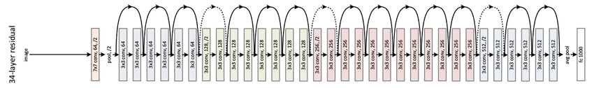

# Landmarks-Classification

## Project Overview
This Project aims to build a convolutional neural network that classify the landmark in the input image using `PyTorch`. The high level steps of the project include:

- Creating a CNN to Classify Landmarks (from Scratch) - visualize the dataset, process it for training, and then build a convolutional neural network from scratch to classify the landmarks. 

- Creating a CNN to Classify Landmarks (using Transfer Learning) - investigate different pre-trained models and decide on one to use for this classification task. Along with training and testing this transfer-learned network.

- Writing a Landmark Prediction Algorithm -  use the best model to create a simple interface for others to be able to use the model to find the most likely landmarks depicted in an image.

Both networks are trained and tested on a subset of `Google landmarks dataset v2`. Accordingly, this is considered as a multi-classification problem where we should train the network on **50 different classes**.

## Data Preperation

The following table explain the training, validation, and testing datasets sizes:

| Dataset | #_of_images |
| ----------- | ----------- |
| Training | 4497 |
| Validation | 499 |
| Testing | 1250 | 

Transformation is applied to all datasets to resize and normalize images. Also, the `DataLoader` is used to wrap the datasets.
The batch size used is 8 images, which means the model is trained on 8 images on each dataloader iteration.

## Network Architecture
The project includes creating, training, and testing two neural netoworks with different architecture. The first one is built from the scratch and the other one is created by applying transfer learning. Lets go in deep with each network's details:

### Building from the Scratch:
The network here consists of Convolutional, Linear, Maxpool, and Dropout  layers in addtion to ReLU activation function:
- 6 convolutional layers: Used to extract the main features from images.
- 3 linear layers: Used to classify the images by producing probability distribution, resulting in each class probability for the input image (Multi-class classification).
- 6 maxpool layers: Used to avoid overfitting after each convolutional layer
- 2 dropout layers: used after the linear layers to avoid overfitting
- ReLU function: Used as activation function for all layers except the last one (the output layer)

Note that the input size should be (800, 800, 3) for each image.

### Transfer Learning:
The second network is created by using the pre-trained version of `ResNet34`, which is a 34 layer convolutional neural network that can be utilized as a state-of-the-art image classification model. This netowrk has been trained on the `ImageNet` dataset--a dataset that has 100,000+ images across 200 different classes. 

In our case, we could replace the last FC layer to give the desired output classes (50) instead of 1000. The input image size for the network should be (3, 224, 224).

## Training and Testing
Training process was challeging as it required a powerful GPU to train the networks. We could use `Tesla T4` GPU with 12GB memory to perform training and testing. The training was run for a specific number of epochs for each netowrk. The training process for each epoch can be illsutrated in the following steps:

- Taking the batch (8 images) from the training loader
- Calculating the output using the feedforward process
- Calculating the loss (error)
- Apply backpropagation to update the network weights
- Updating the training loss for the current epoch

After looping over the whole batches, the validation process starts to evaluate the model performane and avoid overfitting:

- Taking the batch (8 images) from the validation loader
- Finding the output using the feedforward process by the updated network
- Calculating the loss (error)
- Updating the validation loss for the current epoch
- If the current validataion loss is less than the lowest loss recorded, then save the model and update the lowest (min) validation loss

> The first (scratch) network is trained in 75 epochs. However, the training validation loss started incrasing after the 11th epoch. For the second one (transfer learning), the network is trained for 20 epochs and there was a chance for more training epochs as the validation loss was still decreasing.

After testing both networks 

### From-the-Scratch Network

